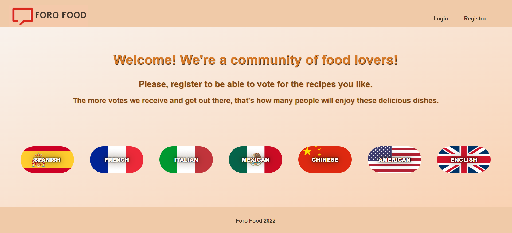
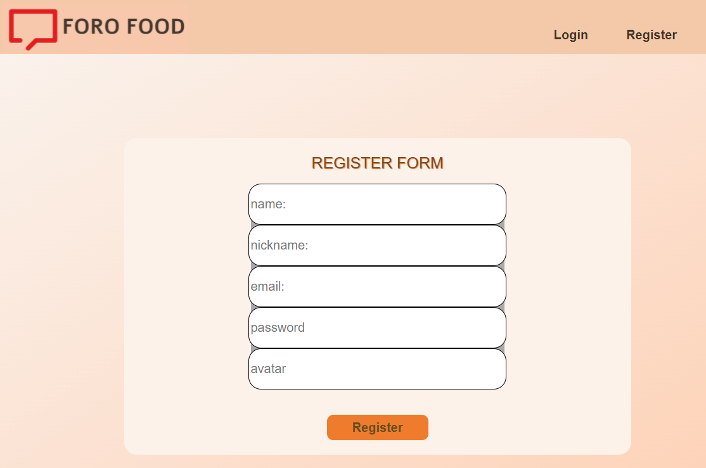
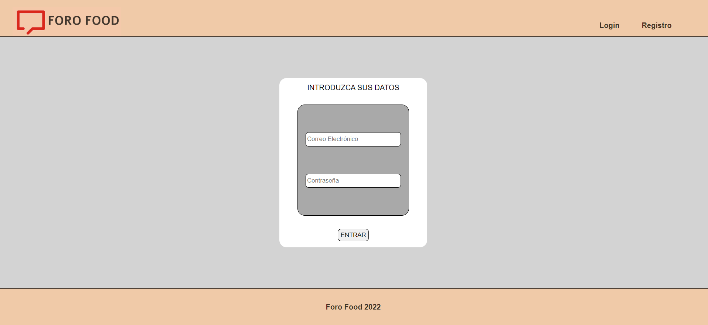
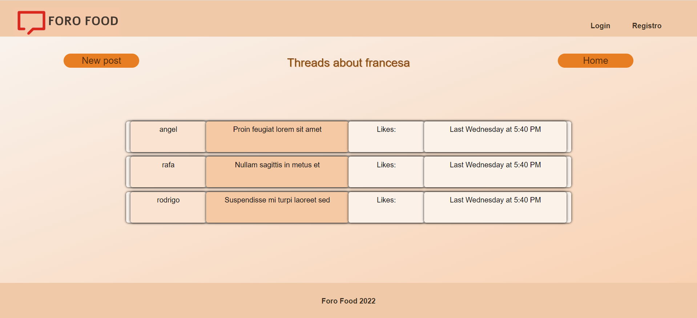
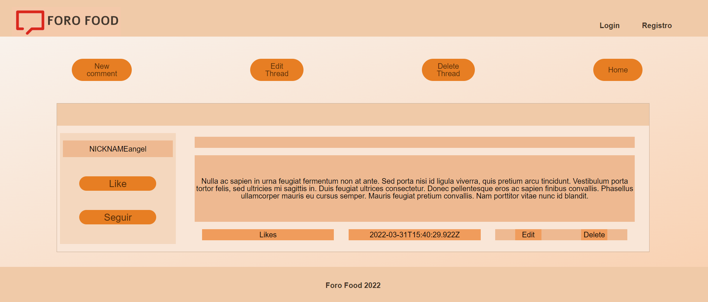

Frontend Red Social Foro Food

Este proyecto realizado en conjunto en GeeksHubs Academy consiste en la realización de un FrontEnd de un foro sobre comida internacional donde el usuario se puede registrar y realizar tanto consultas como seguir o crear nuevos nuevos temas de conversacion y tambien leer y crear comentarios.
Hemos utilizado React como libreria de JavasCript, Redux paras manejar las actualizaciones de los hooks y Axios para realizar las llamadas al backend.

---------------------------------------------------------------------------------------------------------------------------------------------------------

Pre-requisitos 📋
Se necesitará un IDE para la instalación del proyecto, en este caso hemos usado Visual Studio Code. 

Tecnologías utilizadas 🚀
El proyecto ha sido desarrollado utilizando los siguientes paquetes:

Axios
Moment
React
React-dom
React-redux
React-router-dom
React-scripts
Redux
Redux-localstorage-simple
Web-vitals

---------------------------------------------------------------------------------------------------------------------------------------------------------

¿Cómo desplegar el proyecto? 

Las siguientes instrucciones permiten obtener una copia local del proyecto para investigación de códgio o de desarollo:

Para clonar el repositorio localmente usar el comando: git clone  + url del repositorio 

Para instalar las dependencias necesarias usar el comando: npm i

Para iniciar el proyecto usar el comando: npm start

...ya está listo el front-end de FORO FOOD!

¿Cómo desplegar el backend de nuestro proyecto?

Vsita el repositorio ..... y sigue las intsrucciones.

---------------------------------------------------------------------------------------------------------------------------------------------------------

VISTAS DEL PROYECTO

// VISTA DE HOME

// VISTA DE REGISTRO

// VISTA DE LOGIN

// VISTA DE PERFIL
FALTA

// VISTA DE ADMIN
FALTA

// VISTA DE HILOS

// VISTA DE POSTS

---------------------------------------------------------------------------------------------------------------------------------------------------------

Funcionalidad de la APP 🛠️

En nuestra APP podrás realizar las siguientes acciones:

El usuario podrá:

- Registrarse.
- Hacer Login.
- Modificar sus datos de perfil
- Seleccionar tipos diferentes de comida
- Consultar, crear, y editar hilos de conversación que llamaremos "Thread" en nuestra APP.
- Consultar, crear, editar, y eliminar comentarios que llamaremos "Comment" en nuestra APP.
- Dar likes en los comentarios que le guste.
- Seguir a otros usuarios

El administrador podrá:
- Ver todos los usuarios.
- Ver todos los hilos conversación.
- Ver todos los comentarios.
- Moderar los hilos de conversación.
- Moderar los comentarios.

---------------------------------------------------------------------------------------------------------------------------------------------------------
¿Dónde esta alojado nuestro proyecto?
Hemos utilzado ¿AWS?
---------------------------------------------------------------------------------------------------------------------------------------------------------

En el siguiente enlace podrás acceder directamente a nuestra aplicación:
XXXXXXXXXXXXXXXXXXXXXXXXXXXXXXXXXXXXXXXXXXXXXXXXXXXXXXXXXXXXXXXXXXXXXXXX

---------------------------------------------------------------------------------------------------------------------------------------------------------

Autores ✒️
Angel Garrigues  https://github.com/angelgr-com/
Rafa Orti https://github.com/RafaelOrti
Rodrigo Campos https://github.com/RCD1985-GT