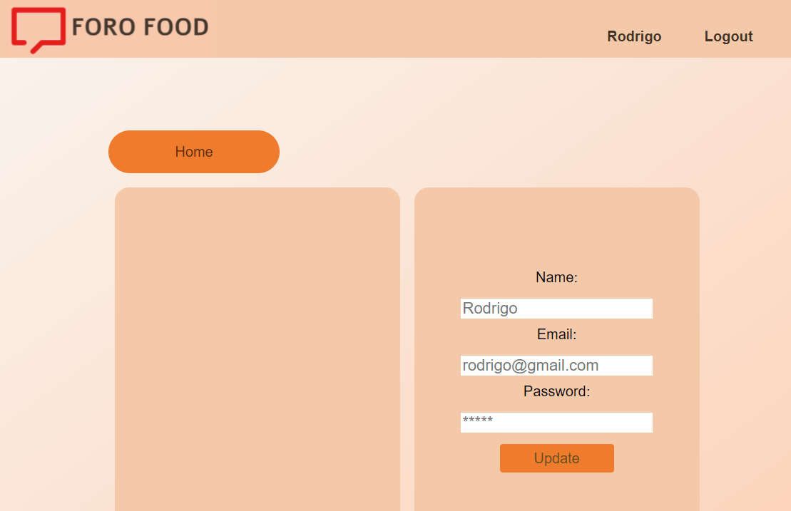

# Frontend Red Social - Foro Food

[Foro Food - Enlace para visitar el proyecto finalizado](https://main.d3dvg1o4r0h473.amplifyapp.com/)

- Este proyecto se ha realizado durante la formación Full Stack Devoper de [GeeksHubs Academy](https://geekshubs.com/academy/coding-school/).

- Consiste en la realización de un FrontEnd de un foro sobre comida internacional donde el usuario puede:

  - Registrar sey realizar tanto consultas como seguir o crear nuevos nuevos temas de conversacion

  - También leer y crear comentarios.

Hemos utilizado:

- React como libreria de JavasCript
- Redux para manejar las actualizaciones de los Hooks
- Axios para realizar las llamadas [al backend](https://github.com/angelgr-com/backend-red-social), en el que se implementa un CRUD mediante una API REST.

---------------------------------------------------------------------------------------------------------------------------------------------------------

## Pre-requisitos 📋

Se necesitará un IDE para la instalación del proyecto, en este caso hemos usado Visual Studio Code. 

### Tecnologías utilizadas 🚀

El proyecto ha sido desarrollado utilizando los siguientes paquetes:

- Axios (0.26.1)
- Moment (2.29.1)
- React (17.0.2)
- React-dom (17.0.2)
- React-redux (7.2.6)
- React-router-dom (6.2.2)
- React-scripts (5.0.0)
- Redux (4.1.2)
- Redux-localstorage-simple (2.4.1)

---------------------------------------------------------------------------------------------------------------------------------------------------------

### ¿Cómo desplegar el proyecto? 

Las siguientes instrucciones permiten obtener una copia local del proyecto para investigación de códgio o de desarollo:

Para clonar el repositorio localmente usar el comando:

```
git clone https://github.com/angelgr-com/frontend-red-social.git
```

 Para instalar las dependencias necesarias se usará el comando:

```
npm i
```

Para iniciar el proyecto usar el comando:

```
npm start
```

...ya está listo el front-end de **FORO FOOD**!

¿Cómo desplegar el backend de nuestro proyecto?

Se encuentra desplegado en Heroku, por lo que no es necesario realizar ninguna acción más. Enlace al repositorio del backend: [backend-red-social](https://github.com/angelgr-com/backend-red-social)

---------------------------------------------------------------------------------------------------------------------------------------------------------

## Vistas del proyecto

### Home


### Registro


### Login


### Perfil



### Hilos


### Posts

### 


---------------------------------------------------------------------------------------------------------------------------------------------------------

## Funcionalidad de la APP 🛠️

En nuestra APP podrás realizar las siguientes acciones:

- El usuario podrá:

  - Registrarse.

  - Hacer Login.

  - Modificar sus datos de perfil

  - Seleccionar tipos diferentes de comida

  - Consultar, crear, y editar hilos de conversación que llamaremos "Thread" en nuestra APP.

  - Consultar, crear, editar, y eliminar comentarios que llamaremos "Comment" en nuestra APP.

  - Dar likes en los comentarios que le guste.

  - Seguir a otros usuarios


---------------------------------------------------------------------------------------------------------------------------------------------------------
## ¿Dónde esta alojado nuestro proyecto?

El despliegue de la aplicación se ha realizado en Amazon Web Services mediente el servicio Amplify.

Se puede acceder mediante el siguiente enlace:

https://main.d3dvg1o4r0h473.amplifyapp.com/

---------------------------------------------------------------------------------------------------------------------------------------------------------

## Autores ✒️

Angel Garrigues  https://github.com/angelgr-com/

Rafa Orti https://github.com/RafaelOrti

Rodrigo Campos https://github.com/RCD1985-GT